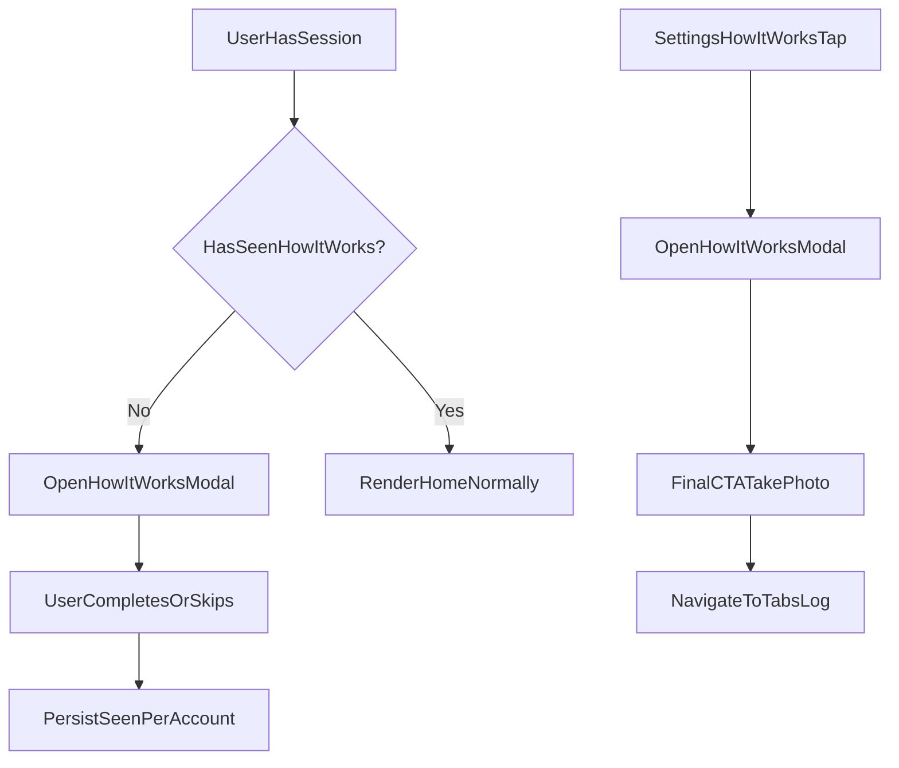

# First-Time Tutorial + Settings Relaunch Plan

## Outcome

Ship a modal carousel tutorial (7 cards + final CTA card) that:

- auto-opens once for first-time logged-in users,
- can always be reopened from Settings via **How it works**,
- uses interactive card UI that mirrors real app actions,
- routes final CTA to the Log tab (no forced capture auto-open).

## Architecture

## Implementation Steps

### 1) Add per-account seen-state service + hook

- Create a focused tutorial-state module to read/write a per-user `has_seen_how_it_works` flag (or equivalent field) via Supabase user metadata/profile table.
- Add a small hook returning:
  - `isLoadingSeenState`
  - `hasSeenHowItWorks`
  - `markHowItWorksSeen()`
- Keep local in-memory state to avoid repeated network calls during one session.

Primary files:

- [lib/supabase.ts](/Users/joshmaldonado/Desktop/git-projects/mealscanner-mobile/lib/supabase.ts)
- [hooks](/Users/joshmaldonado/Desktop/git-projects/mealscanner-mobile/hooks) (new hook file)

### 2) Build reusable modal carousel component

- Create a dedicated component for the tutorial modal (full-screen modal + horizontal pager/carousel + progress dots).
- Implement 7 content cards exactly as provided, plus final CTA card.
- Each card includes interactive mock UI elements (tappable/animated affordances) that visually match app controls (camera, mic/text input, database/recipe entry points).
- Add controls:
  - Next / Back
  - Skip
  - progress indicator (card x/y)
- Final card actions:
  - Primary: `Take a photo` -> navigate to `/(tabs)/log`
  - Secondary: `Skip for now` -> close modal

Primary files:

- [components](/Users/joshmaldonado/Desktop/git-projects/mealscanner-mobile/components) (new `HowItWorksTutorialModal.tsx`)
- Reuse styling/components from:
  - [components/ui/Button.tsx](/Users/joshmaldonado/Desktop/git-projects/mealscanner-mobile/components/ui/Button.tsx)
  - [components/ui/Card.tsx](/Users/joshmaldonado/Desktop/git-projects/mealscanner-mobile/components/ui/Card.tsx)
  - [components/ui/IconSymbol.tsx](/Users/joshmaldonado/Desktop/git-projects/mealscanner-mobile/components/ui/IconSymbol.tsx)

### 3) Auto-trigger once for first-time logged-in users

- In Home screen mount flow, after auth is ready and user exists, load `hasSeenHowItWorks`.
- If false, present tutorial modal immediately.
- On first dismiss/complete, call `markHowItWorksSeen()` to prevent future auto-trigger.

Primary file:

- [app/(tabs)/index.tsx](/Users/joshmaldonado/Desktop/git-projects/mealscanner-mobile/app/(tabs)/index.tsx)

### 4) Add Settings entry point

- Add a new menu row in Profile -> OTHER section:
  - Title: `How it works`
  - Route: new `settings/how-it-works` screen or direct modal open strategy.
- Recommended: add dedicated route screen that hosts the same tutorial modal component, so behavior is decoupled and easy to relaunch.

Primary files:

- [app/(tabs)/profile.tsx](/Users/joshmaldonado/Desktop/git-projects/mealscanner-mobile/app/(tabs)/profile.tsx)
- [app/settings](/Users/joshmaldonado/Desktop/git-projects/mealscanner-mobile/app/settings) (new `how-it-works.tsx`)
- [app/settings/_layout.tsx](/Users/joshmaldonado/Desktop/git-projects/mealscanner-mobile/app/settings/_layout.tsx) (optional explicit screen registration)

### 5) Content constants + maintainability

- Move card copy into a typed constant array to simplify edits and localization later.
- Include optional tip/example lines exactly where specified in your content.

Primary files:

- [constants](/Users/joshmaldonado/Desktop/git-projects/mealscanner-mobile/constants) (new tutorial content constant)

### 6) QA + edge-case checks

- Validate first-login behavior with fresh account.
- Validate returning user behavior (no auto-popup).
- Validate relaunch from Settings always works.
- Validate final CTA goes to Log tab consistently from both auto and Settings launch contexts.
- Validate no regressions in Home loading states and auth redirect timing.

## Key Non-Obvious Integration Points

- Home already gates on auth readiness in [app/(tabs)/index.tsx](/Users/joshmaldonado/Desktop/git-projects/mealscanner-mobile/app/(tabs)/index.tsx); tutorial trigger should attach to that lifecycle rather than root layout.
- Settings “OTHER” list is already centralized in [app/(tabs)/profile.tsx](/Users/joshmaldonado/Desktop/git-projects/mealscanner-mobile/app/(tabs)/profile.tsx), making it the clean insertion point for `How it works`.
- Cross-platform icon support requires mapped names in [components/ui/IconSymbol.tsx](/Users/joshmaldonado/Desktop/git-projects/mealscanner-mobile/components/ui/IconSymbol.tsx); add any new symbols there if used in tutorial mock controls.

