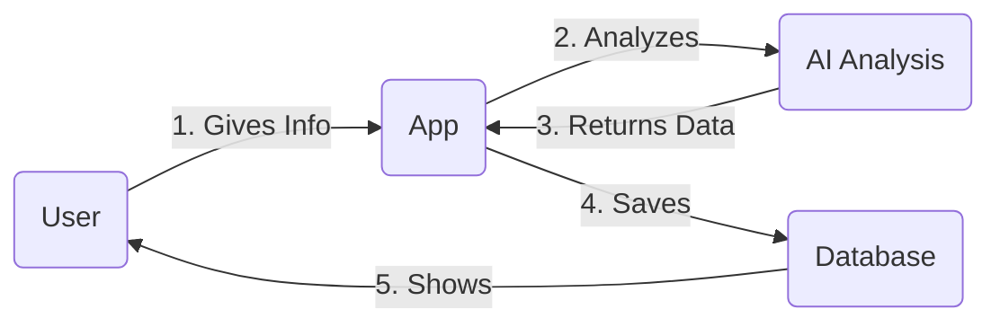
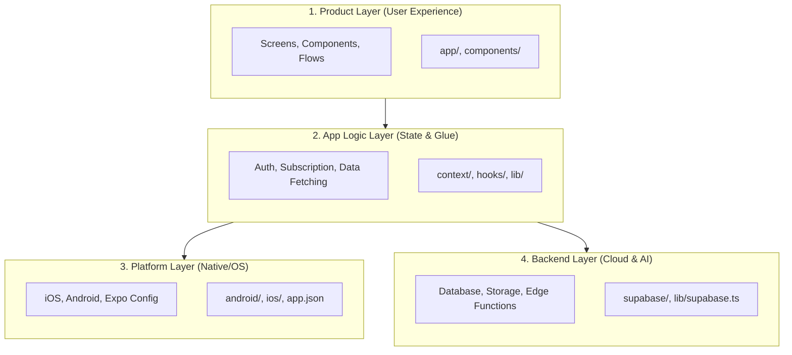
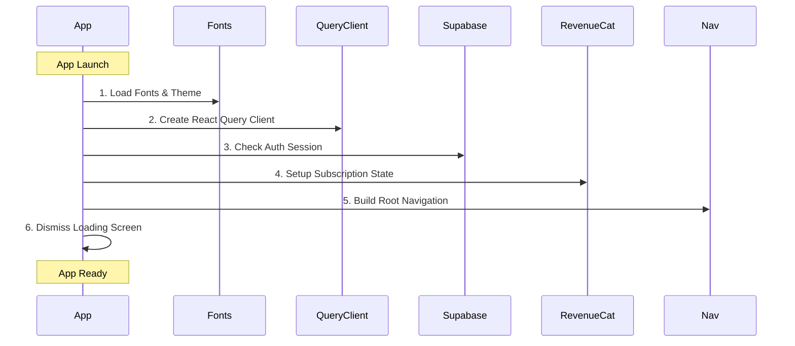
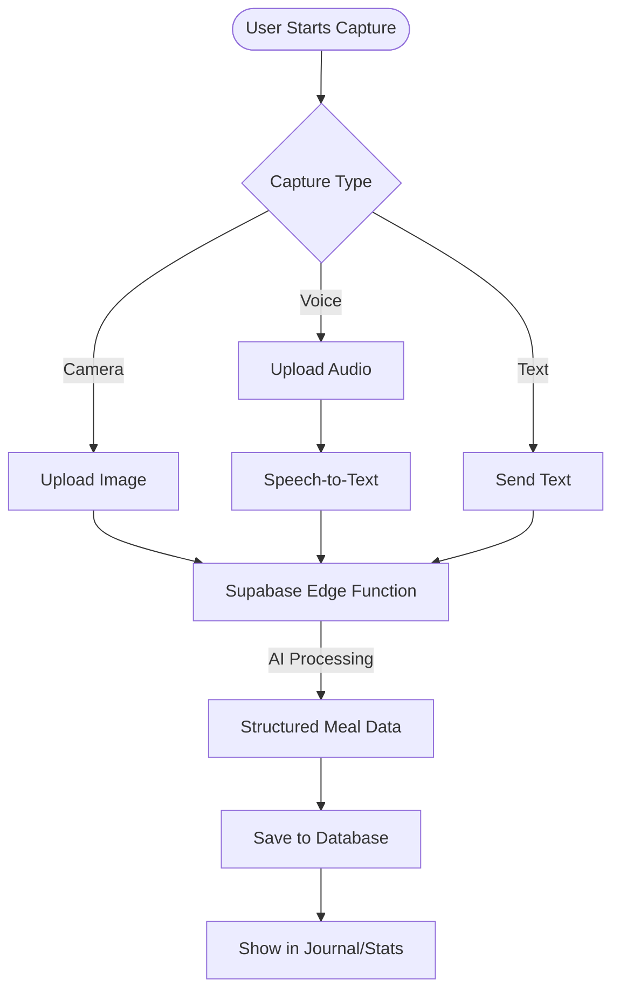
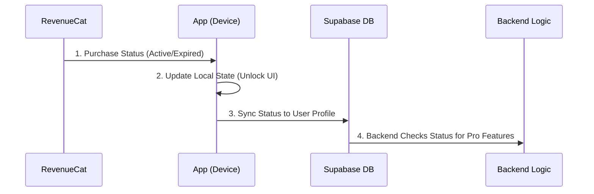

# MealScanner Operator Manual

This document is a plain-English guide to how the app works.

It is written for a future you who wants to understand the system without needing to think like a full-time mobile engineer.

If the codebase ever feels intimidating, start here.

## What This App Is

MealScanner is a mobile app that helps someone:

- capture a meal with camera, text, voice, or saved recipe
- send that meal through analysis
- save the result to a personal journal
- show progress, recommendations, and subscription-gated features

In simple terms:

1. The user gives the app meal information.
2. The app turns that information into structured nutrition data.
3. The app saves the result.
4. The user sees it later in the journal, reports, recipes, and profile flows.

That is the core loop.

## The Four Layers

The easiest way to understand this app is as four layers.

### 1. Product Layer

This is what the user experiences.

It includes:

- screens
- tabs
- forms
- buttons
- cards
- flows like capture, journal, recipes, and profile

Main places:

- `app/`
- `components/`

If you are asking:

- "What screen shows this?"
- "Where does the user tap this?"
- "What should this flow feel like?"

You are in the product layer.

### 2. App Logic Layer

This is the glue that keeps the product layer working.

It includes:

- shared app state
- auth state
- subscription state
- capture state
- data fetching
- helper functions that talk to the backend

Main places:

- `context/`
- `hooks/`
- `lib/`

If you are asking:

- "How does the app know if the user is logged in?"
- "Where does it fetch meals from?"
- "How does the app know whether someone is Pro?"

You are in the app logic layer.

### 3. Platform Layer

This is the part that touches iOS, Android, Expo, and native libraries.

It includes:

- build configuration
- native modules
- app permissions
- RevenueCat native SDK
- camera
- notifications
- health integrations
- Android and iOS folders

Main places:

- `android/`
- `ios/`
- `app.json`
- `eas.json`
- native-heavy libraries in `package.json`

If you are asking:

- "Why is EAS build failing?"
- "Why does this work on web but not iPhone?"
- "Why did an upgrade suddenly break Android?"

You are in the platform layer.

### 4. Backend Layer

This is the cloud side.

It includes:

- authentication
- database reads and writes
- storage for meal images and audio
- edge functions for AI analysis and server-side actions

Main places:

- `supabase/functions/`
- `supabase/migrations/`
- `lib/supabase.ts`

If you are asking:

- "Where is the meal actually saved?"
- "Where does the AI analysis happen?"
- "Where is subscription status verified?"

You are in the backend layer.

## The Main Mental Model

Here is the simplest mental model for the whole app:

- `app/` decides which screen the user is on
- `components/` renders the visible UI
- `context/` keeps important app-wide state available
- `lib/` talks to external systems like Supabase and RevenueCat
- `supabase/functions/` handles AI and server-side actions
- `android/` and `ios/` are the native shells that let the app ship

The app is not one giant blob.

It is closer to:

- user interface on top
- shared logic in the middle
- services underneath
- native and backend systems around the edges

That is much more stable than a "house of cards" mental model.

## The Most Important Files

If you only remember a few files, remember these.

### App entry point

- `app/_layout.tsx`

This is the front door of the app.

It sets up the provider stack and navigation:

- query client
- theme
- auth
- subscription
- root navigation
- loading screen
- notifications

If the whole app feels like it "boots up" in a certain order, this file is why.

### Main tab shell

- `app/(tabs)/_layout.tsx`

This sets up the main app navigation and the capture entry points.

It is where the app feels like a product instead of just a collection of screens.

### Auth state

- `context/AuthContext.tsx`

This answers:

- who is signed in?
- is the session still loading?
- how does sign-out work?

### Subscription state

- `context/SubscriptionContext.tsx`

This answers:

- is the user Pro?
- what does RevenueCat say?
- how do paywalls open?
- when do we sync subscription status back to the backend?

### Capture state

- `context/CaptureContext.tsx`

This controls the capture sheet and capture flow state.

This matters because capture is one of the central user actions in the app.

### Backend gateway

- `lib/supabase.ts`

This is one of the most important files in the app.

It is the main client-side gateway to:

- auth
- profile
- meals
- recipes
- uploads
- edge functions
- weekly reports
- support actions

If you ever wonder "where is the actual business action happening?", there is a good chance the answer starts here.

### Subscription service wrapper

- `lib/revenueCat.ts`

This is the client-side wrapper around purchases and entitlements.

### Data cache

- `lib/queryClient.ts`
- `hooks/queries/`

This is how the app avoids constantly refetching the same data.

## How The App Starts Up

On launch, the app roughly does this:

1. Loads fonts and theme setup.
2. Creates the React Query client.
3. Checks auth session with Supabase.
4. Sets up subscription state with RevenueCat.
5. Builds the root navigation.
6. Dismisses the loading screen when the app is ready.

This startup sequence lives mostly in `app/_layout.tsx`.

That means if the app ever feels stuck on launch, the likely causes are:

- auth session check
- fonts/loading screen logic
- provider initialization
- notification startup

## How The Core Meal Flow Works

This is the product heartbeat of the app.

### Capture

The user starts from the capture action sheet or capture-related screens.

Relevant places:

- `app/(tabs)/_layout.tsx`
- `context/CaptureContext.tsx`
- `components/capture/`

### Upload / input preparation

Depending on the source, the app may:

- upload an image
- upload audio
- transcribe speech
- send text directly
- send a multi-item payload

Relevant place:

- `lib/supabase.ts`

### Analysis

The app calls Supabase Edge Functions such as:

- `analyze-meal-image`
- `analyze-meal-text`
- `analyze-meal-multi`
- `speech-to-text`
- `speech-to-text-direct`

Relevant place:

- `supabase/functions/`

### Save and display

After analysis, the meal gets saved and later appears in places like:

- home
- journal
- meal detail
- streaks
- reports

## How Subscription Works

Conceptually:

1. RevenueCat decides what the purchase status is.
2. The app reads that status on-device.
3. The app syncs the result to Supabase for server-authoritative use.
4. The backend can then decide what paid features are allowed.

This is important because some features depend on the server knowing whether the user is Pro, not just the phone knowing it.

Main files:

- `context/SubscriptionContext.tsx`
- `lib/revenueCat.ts`
- `lib/supabase.ts`
- `supabase/functions/sync-subscription-tier/`

## How To Think About New Features

When adding a feature, ask these questions in order:

1. What should the user experience be?
2. Which screen or component owns that experience?
3. Does this need app-wide state, or just local screen state?
4. Does it require backend data?
5. Does it require a native capability?

That question chain usually tells you where the work belongs.

### Add to `components/` when:

- it is mostly presentation
- it is reused in multiple screens
- it is a card, modal, section, button, header, or visual block

### Add to `app/` when:

- it is a route or screen
- it owns navigation
- it represents a user journey

### Add to `context/` when:

- many parts of the app need the same shared state
- the state should survive screen changes

### Add to `lib/` when:

- it talks to Supabase
- it talks to RevenueCat
- it wraps an external service
- it is business logic that should not live inside a component

### Add to `supabase/functions/` when:

- the logic needs secrets
- the logic should happen on the server
- AI calls should not come directly from the client
- the backend must be the source of truth

## What Feels Fragile vs. What Is Usually Stable

### Usually stable

- screen layout changes
- copy changes
- adding or adjusting components
- most app-level logic inside `components/`, `app/`, and `lib/`
- adding Supabase reads and writes that match existing patterns

### More fragile

- Expo SDK upgrades
- React Native upgrades
- native dependencies
- Android/iOS build config
- camera/audio/notifications/health integrations
- anything involving CMake, Pods, Gradle, or CocoaPods

This does not mean "never touch" the fragile parts.

It means:

- isolate those changes
- test them deliberately
- do not combine them with lots of unrelated feature work

## The Healthiest Way To Work In This Repo

The app will feel much safer if changes are made in small, understandable moves.

Good pattern:

1. Make one focused change.
2. Check where it lives in the four-layer model.
3. Validate the affected flow.
4. Commit once the change is understood.

Less healthy pattern:

- upgrade dependencies
- change navigation
- refactor capture
- tweak backend behavior
- touch native build config

all in one pass

That is when a codebase starts to feel impossible to reason about.

## If Something Breaks, Ask These Questions

### If the UI looks wrong

Ask:

- is this a screen problem?
- a component problem?
- a theme/styling problem?

Start in:

- `app/`
- `components/`
- `constants/`

### If data is missing or stale

Ask:

- did the fetch happen?
- is the query cached?
- did Supabase return what we expected?

Start in:

- `hooks/queries/`
- `lib/supabase.ts`
- `lib/queryClient.ts`

### If login or session behavior is weird

Start in:

- `context/AuthContext.tsx`
- `lib/supabase.ts`

### If subscription behavior is wrong

Start in:

- `context/SubscriptionContext.tsx`
- `lib/revenueCat.ts`
- `supabase/functions/sync-subscription-tier/`

### If build or native behavior breaks

Start in:

- `package.json`
- `app.json`
- `eas.json`
- `android/`
- `ios/`

This is the platform layer, not necessarily a sign that the app logic is broken.

## Practical Rules Of Thumb

- Prefer understanding the layer before changing the code.
- Prefer small edits over broad rewrites.
- Prefer removing unused dependencies over keeping "maybe needed" ones.
- Prefer server-side secrets and AI calls in edge functions, not in the app client.
- Prefer copying an existing pattern in the repo over inventing a new one unless there is a strong reason.

## The Real Backbone Of The App

If you want one sentence to remember:

MealScanner is held together by a few clear backbone pieces, not by magic:

- `app/_layout.tsx` starts the app
- `context/` keeps core state available
- `lib/supabase.ts` is the backend gateway
- `lib/revenueCat.ts` handles subscription state
- `supabase/functions/` handles server-side intelligence

As long as those pieces remain understandable, the app remains understandable.

## A Calm Way To Think About This Project

You do not need to hold the entire codebase in your head.

You only need to know:

- which layer you are changing
- which file is the owner of that responsibility
- what user flow you are affecting

That is enough to keep improving the app safely.

This project is not a perfect machine, but it is also not a collapsing tower.

It is a product with real structure.

And now you have a map.
